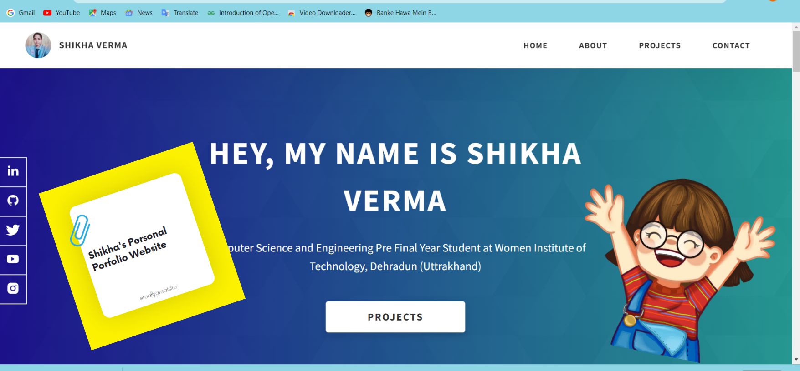

# Dopefolio 🔥

## My Personal Portfolio  🚀

## [Website Link](https://shikha7124v.github.io/Shikha-Verma/) 🔗

  
   

 
 

---

 

----

 
## Features

- ### **Multi Page 💎** 
- ### **Fully Responsive 🚀** 
- ### **No Additional Frameworks 🤘** 
- ### **No Additional Libraries 🙌** 
- ### **Super Fast and Optimized for SEO ⚡** 
- ### **Great Audits Score 🎖️** 

 
 

## Test the template with different colors on the playground link 🚀

## [Playground Link](https://shikha7124v.github.io/Shikha-Verma/) 🔗

  
   

 

----

 

## Technologies used 🛠️

- **HTML** 🚀
- **CSS** 🚀
- **JavaScript** 🚀
- **SASS** 🚀

---

 
---

 

## Deployment 📦

Once you have done with your setup. You need to put your website online!

I highly recommend to use [Netlify](https://netlify.com) to achieve this on the EASIEST WAY

Whenever you wanna host a new site on Netlify. You will need to press the **Create New Site** button from the Netlify's dashboard once you login into Netlify.

Once you press the **Create Site Button** then you will have to follow the 3 steps:

1. You will have to select your Github account.

2. Then select the Repository which you wanna host, in this case its your Portfolio website ( Clone of Dopefolio )

3. In the 3rd step, you will have to modify the **Site settings and deploy**, keep everything as it is but just make sure to modify the **Build command** and set its value to **npm run build** and then modify the **Publish directory** and set its value to **/** as shown in the  **image** below

  
   

 

Then hit the **Deploy site** button and your **Portfolio Site** is live 🥳

 

---

 

## Give a Star ⭐

If you like this project then give it a **Github** star by pressing the **Star** button ⭐

 

---

 

## Author 👨‍💻

- **Shikha Verma** - **[Linkedin](https://www.linkedin.com/in/shikha-verma-616499206/)**, **[Twitter](https://twitter.com/ShikhaV78243683)**, **[Github](https://github.com/shikha7124v)**, **[Portfolio]()**  

 

#### Note: 
I'm currently looking for good **Job Opportunities** both **Remote ( Worldwide )** and **On-Site ( Anywhere in India )**. So, if you have a good opportunity that matches my skills experience then you can contact me on my **[Linkedin](https://www.linkedin.com/in/shikha-verma-616499206/)** or my email id **shikhavarma1218@gmail.com** 🙌

 

---

## License 📄

This project is licensed under the  **GPL-3.0** License - see the [LICENSE](LICENSE) file for details

